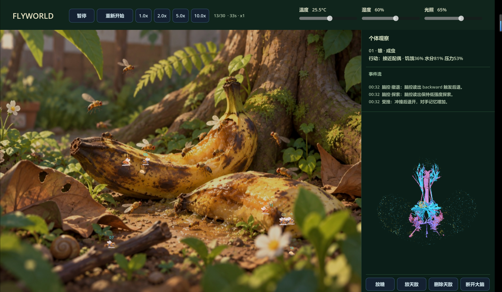

# FLYWORLD

FLYWORLD 是一款果蝇生态观察模拟器。观察橙、蓝两组果蝇在后院中觅食、飞行、繁殖和应对天敌，也可连接 MaleCNS 神经模型查看个体的计算模拟活动。每局从每种颜色 4 只成虫开始，种群上限为 30 只。

## 下载与启动

[下载 Windows x64 版](https://github.com/welkinhh/FLYWORLD-MaleCNS/releases/latest)。解压后保持 `FLYWORLD.exe` 和 `brain_service.exe` 在同一目录，双击 `FLYWORLD.exe`。无需安装 Godot 或 Python。

首次连接大脑时，程序会联网下载神经模型数据。未连接大脑时，生态模拟仍可运行。

## 操作

- 点击果蝇查看个体状态和事件。
- 点击“放糖”或“放天敌”，再点击场景放置；点击“删除天敌”后，选择蜘蛛移除。
- 顶栏可暂停、重新开始、调整倍速、温度、湿度和光照。
- 滚轮缩放画面，右键复位视角，Esc 取消当前工具。

## 模拟说明

大脑信号是基于神经连接组的计算模拟，不是活体神经记录；生态行为采用简化规则，不用于生物学预测。
